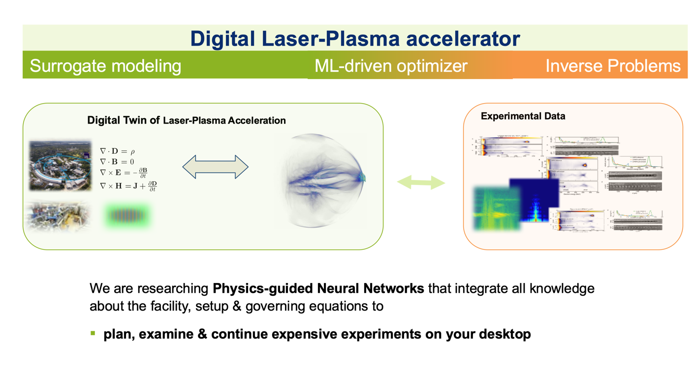

Laser-plasma accelerators make large, conventional particle accelerators more compact, less costly, as well as increase broad availability and access in science, industry and medicine. However, comprehension of the involved physics requires sophisticated and computationally demanding algorithms for simulation and reconstruction. The Helmholtz AI young investigator group aims to close the loop between theory and experiment by researching data-driven digital twinning techniques that stimulate theoretical comprehension as well as experimental validation of the very complex dynamics involved in laser-particle acceleration.

Research focus
======
Our declared goal is to research **digital twins of future Laser-driven particle accelerators** which comprises of surrogate modeling, uncertainty quantification / outlier detection as well as solution of inverse imaging problems for fast understanding of experimental data.

We therefore research recent surrogate modelling techniques such as Physics-informed Neural Networks for acceleration of state-of-the-art Particle-In-Cell simulations ([PIConGPU](https://github.com/ComputationalRadiationPhysics/picongpu)) and identification of unmodelled dynamics from data (PDE identification & learning).  Those dynamics are experimentally observed, e.g. X-ray diffraction experiments, by reconstruction of diffraction data by reliable neural networks. The latter revolutionize the way scattering experiments are carried out by fast and reliable data analysis leveraging large amounts of training data and injection of prior knowledge into the inference procedure of neural networks.

Team
======
[**Nico Hoffmann**](mailto:n.hoffmann@hzdr.de) head of our young investigator's group *AI for Future Photon Sciences*. Nico earned his PhD in 2016 from Technische Universität Dresden in medical image analysis. He developed statistical machine learning methods that compensate motion artefacts and advanced semiparametric regression models as well as neural networks for intraoperative recognition of evoked neuronal activity of the exposed human brain. He visited the Laboratory of Mathematics in Imaging of Harvard University from 2018 to 2019. During that time, he developed recurrent convolutional neural networks for reconstruction of nerve fibre bundles of the human brain. Right before Helmholtz AI, Nico was with the Computational Radiation Physics group of Helmholtz-Zentrum Dresden-Rossendorf. 

[**Anna Willmann**](XXX)

[**Erik Thiessenhusen**](XXX)

[**Patrick Stiller**](XXX)

[**Maksim Zhdanov**](XXX)
