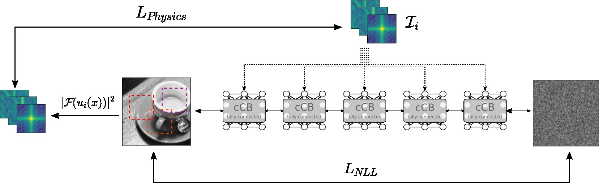

We are currently developing a one-step reconstruction method for inverting SAXS data during experiments at synchrotrons like [DESY](https://desy.de) or our [HIBEF](https://www.hzdr.de/db/Cms?pOid=50566&pNid=694) beamline at [EuropeanXFEL](https://www.xfel.eu). Due to the loss of the phase information, there is often more than one solution for each diffraction pattern. The conditional Invertible Network, a generative model, is able to reconstruct all possible solutions in a matter of milliseconds. The network is trained on perturbed simulated data only with a data-driven negative log-likelihood loss and is able to reconstruct most experimental data.

The library **nfPhasing** expands the data loss by a physics-driven loss that integrates knowledge about the underlying scattering processes.

The general idea is that a conditional Normalising Flow is learning a mapping from experimentally acquired diffraction pattern(s) **I** and some prior distribution to the predictive posterior distribution of electron densities **u**. The neural network is trained by a data-driven objective as well as a Physics-based loss. The former allows for very fast inference (i.e. reconstruction) on data similiar to our training data while the latter enables reconstruction of objects that are out-of-distribution to the training data.

**nfPhasing** is covering the following modalities:
- 1d/2d Small-angle X-ray scattering (at Grazing Incidence)
- 2d Ptychography
- 2d Holography / Phase Contrast Imaging

# Team
* Nico Hoffmann
* Erik Thiessenhusen
* Maksim Zhdanov
